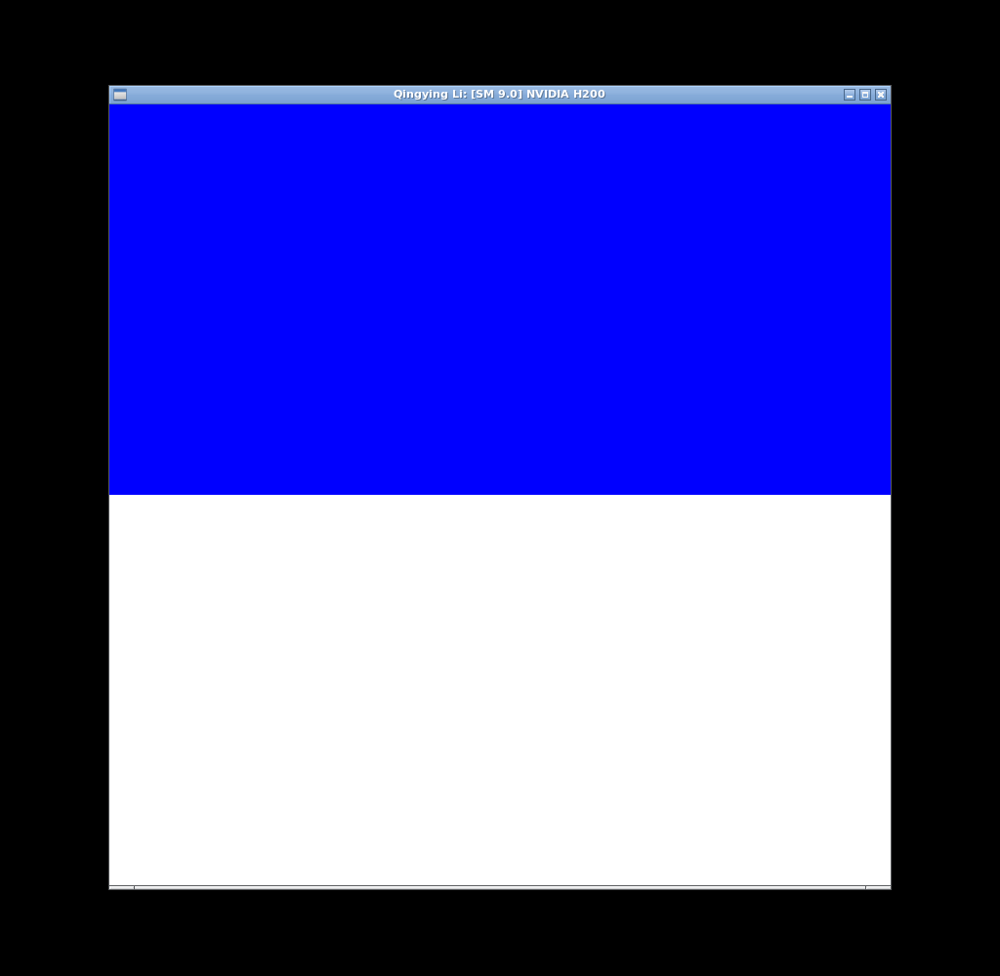
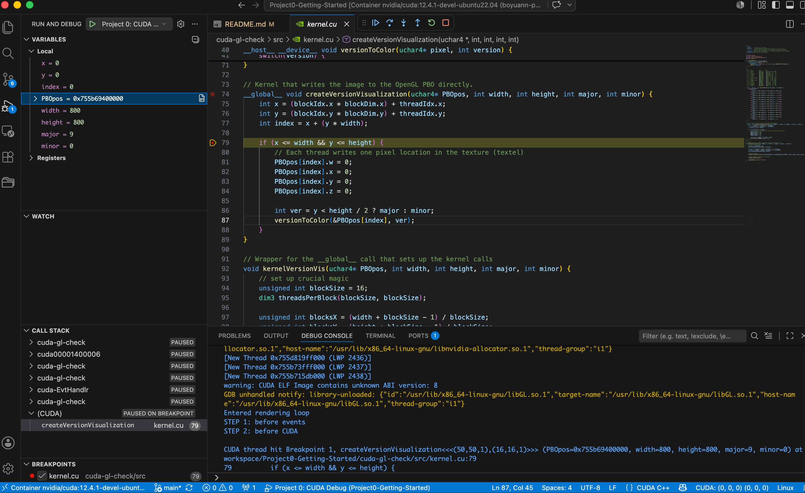
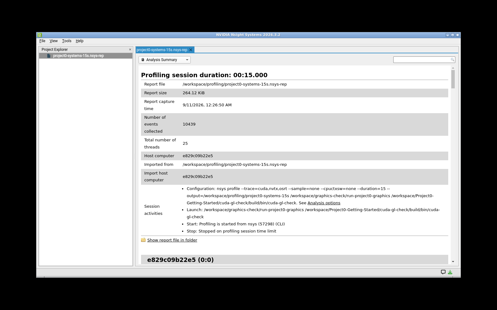
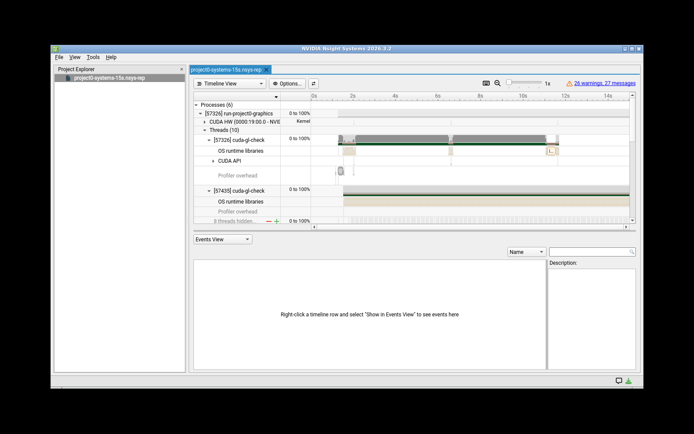
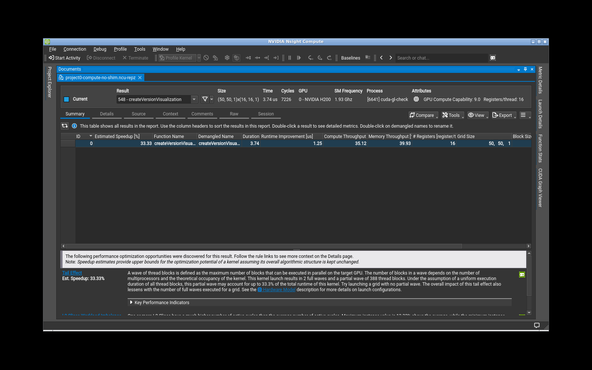
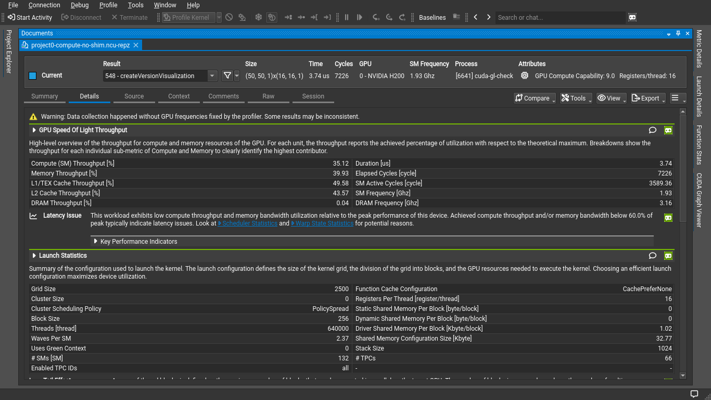
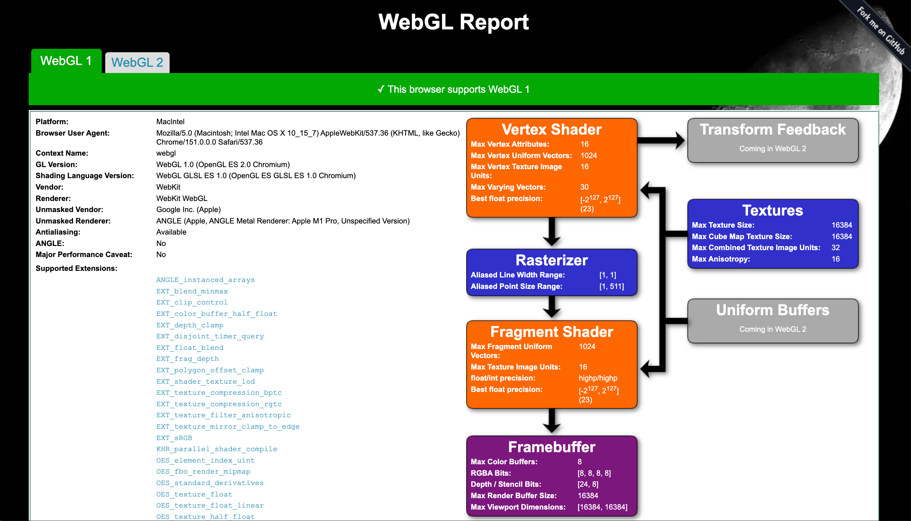
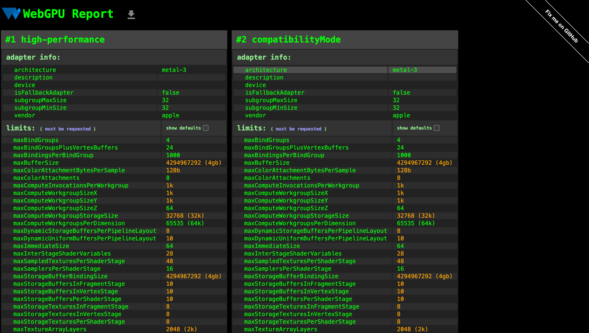

Project 0 Getting Started
====================

**University of Pennsylvania, CIS 5650: GPU Programming and Architecture, Project 0**

* Qingying Li
  * [LinkedIn](https://www.linkedin.com/in/harper-li-292730373/)
* Tested on: personal MacBook Pro, Apple M1 Pro, macOS, Google Chrome (WebGL/WebGPU); lab-provided NVIDIA H200 server, Ubuntu 22.04 Docker container, CUDA Toolkit 12.4, CMake 3.22.1 (CUDA).

### CUDA GL Check

I built and ran the application in a Docker container with access to
one NVIDIA H200 GPU, using CUDA 12.4 and CMake 3.22.1.
The GPU has compute capability 9.0.

I used Xvfb and VirtualGL for remote display. The application shows
blue and white regions, with my name and GPU information in the window title.

### CUDA Debugging

I used Nsight Visual Studio Code Edition to set a breakpoint in
kernel.cu and inspect the GPU thread's local variables.

### Nsight Systems

I collected a 15-second trace with Nsight Systems and viewed
the Analysis Summary and Timeline. The trace recorded three
calls to createVersionVisualization, with an average GPU
execution time of about 4.18 microseconds. This small sample
does not represent steady-state performance.

### Nsight Compute

I profiled createVersionVisualization on the NVIDIA H200 using
Nsight Compute 2026.3.0 and viewed the Summary and Details pages.
The measured GPU duration was 3.74 microseconds. The kernel used
2,500 thread blocks with 256 threads per block.

GPU clocks were not fixed during profiling, so this measurement
does not represent stable benchmark performance.

### WebGL

I checked WebGL in Chrome on my MacBook Pro. The report confirmed
WebGL 1 support and listed Apple M1 Pro in the renderer information.

### WebGPU

I checked WebGPU in Chrome on the same Mac. The report detected
an Apple adapter and displayed its supported features and limits.

